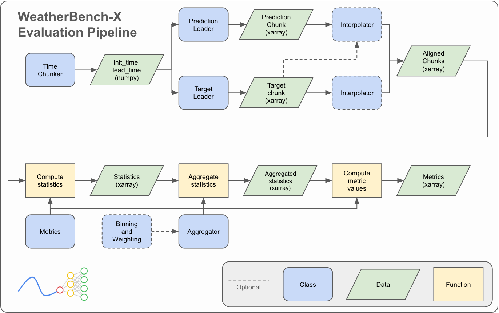

<!--  -->

# WeatherBench-X: A modular framework for evaluating weather forecasts


## Why WeatherBench-X?

WeatherBench-X is an evaluation framework that enables flexible evaluation of various kinds of forecast and ground truth data, including sparse datasets like those coming from weather stations or satellites. It is the successor to the [WeatherBench 2 evaluation code](https://github.com/google-research/weatherbench2). However, the [WeatherBench 2 benchmark](https://sites.research.google/weatherbench/) remains active (and is now also powered by the WeatherBench-X evaluation framework).

WeatherBench related datasets can be found [here](https://weatherbench2.readthedocs.io/en/latest/data-guide.html).

The core design principles behind WeatherBench-X are:
- Modularity: Data loaders, Interpolations, Metrics and the Aggregation can be defined through interoperable classes.
- Xarray: All internal logic is based on xarray DataArrays.
- Scalability: Each operation can be split into small chunks allowing scalable evaluation of very large datasets through Apache Beam.

Below is a flowchart of the WB-X evaluation pipeline.



To get started using WeatherBench-X, check out the [quickstart notebook](quickstart).

For more use cases, see the How To Section.

## Installation

You can install `weatherbenchX` directly from git using pip:

```
pip install git+https://github.com/google-research/weatherbenchX.git
```

If you would like to develop and test the code, first clone the repository:

```
git clone git@github.com:google-research/weatherbenchX.git
```

Then install using pip:
```
pip install -e .
```


<!-- ## Contents -->

```{toctree}
:maxdepth: 1
:hidden:
wbx_quickstart.ipynb
how_to.md
beam_dataflow.md
benchmark.md
api.md
```